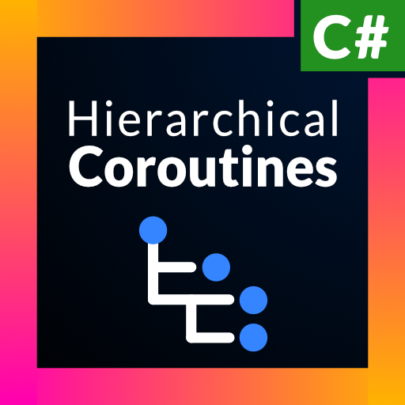
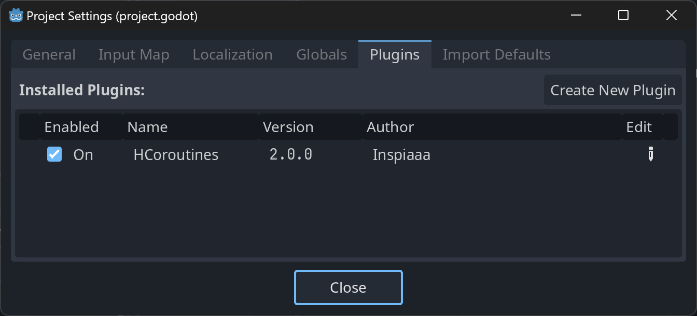

<p align="center"></p>

<p align="center">
	<a href="https://godotengine.org/">
		</a>
	
	<a href="https://github.com/Inspiaaa/HCoroutines/releases">
		</a>
	<a href="https://github.com/Inspiaaa/HCoroutines/blob/master/LICENSE.md">
		</a>
</p>

---

HCoroutines is a library that helps you write game logic in an **intuitive** way by bringing the concept of **hierarchical coroutines** to Godot for the C# language.

This tool has been **specifically designed** for the Godot game engine, making it a breeze to work with features that would otherwise be a headache to integrate with:

- Handles features specific to Godot, such as **signals, tweens and delays**.
- Allows you to run code either in `_Process()` or `_PhysicsProcess()` frames.
- Out of the box support for **pausing** coroutines when the game is paused.

In addition to the above, this library also offers:
- Native support for **async programming and tasks**.
- Easy to use interface to **minimise boilerplate** and **increase readability**.
- Wide array of built-in coroutine types to handle common tasks.

Coroutines are functions that can be paused during execution and then resumed once some condition is met. This allows you to write game logic in sequential steps, defining what logic should be performed when.

This library extends the idea of normal coroutines, e.g. as found in Unity, by allowing them to spawn child coroutines. When the parent coroutine is killed, the child coroutines are also stopped.

---

HCoroutines implements this concept in an efficient and optimised way.

- Regardless of how deep the hierarchy of coroutines gets, the engine only updates the currently active ones, and not ones that are waiting.
- The coroutines themselves are implemented as linked lists, allowing for `O(1)` addition and removal of child coroutines. Because each coroutine is itself a node in the linked list data structure, no additional memory allocations are required.

---

## Example

```csharp
using Godot;
using System.Collections;
using System.Threading.Tasks;

// Import the library.
using HCoroutines;

public partial class Demo : Node2D {
    public override void _Ready() {
        // Spawn a new coroutine that is managed by
        // the default CoroutineManager.
        Co.Run(PlayAnimation());
    }

    private IEnumerator PlayAnimation() {
        GD.Print("Starting animation");

        // Wait one frame.
        yield return null;

        // Wait for the GoTo task to finish before continuing.
        yield return GoTo(new Vector2(100, 100), 2);

        // Wait for two seconds.
        yield return Co.Wait(2);

        // Wait for the parallel coroutine to finish.
        // The parallel coroutine waits until all of its
        // sub-coroutines have finished.
        yield return Co.Parallel(
            Co.Coroutine(GoTo(new Vector2(0, 0), 2)),
            Co.Coroutine(Turn(1))
        );

        // Await an async task that waits for 100ms.
        yield return Co.Await(Task.Delay(100));

        // Await and use the result of an async task.
        var fetch = Co.Await<int>(FetchNumber());
        yield return fetch;
        int number = fetch.Task.Result;

        // Wait for a tween to animate some properties.
        yield return Co.Tween(
            tween => {
                // Change the modulate color over two seconds.
                tween.TweenProperty(this, "modulate", new Color(1, 0, 0), 2);
            }
        );

        // Waits for a signal to be emitted before continuing.
        yield return Co.WaitForSignal(this, "some_signal");
    }

    private IEnumerator GoTo(Vector2 target, float duration) {
        float speed = Position.DistanceTo(target) / duration;

        while (Position.DistanceTo(target) > 0.01f) {
            // delta time can be accessed via Co.DeltaTime.
            Position = Position.MoveToward(target, speed * Co.DeltaTime);
            yield return null;
        }
    }

    private IEnumerator Turn(float duration) {
        float fullRotation = 2 * Mathf.Pi;
        float angularSpeed = fullRotation / duration;
        float angle = 0;

        while (angle < fullRotation) {
            angle += angularSpeed * Co.DeltaTime;
            Rotation = angle;
            yield return null;
        }
    }

    private async Task<int> FetchNumber() {
        await Task.Delay(100);
        return 0;
    }
}
```

## Setup

**Installation via the Asset Library:**

1. In the Godot editor, open the `AssetLib` tab and search for this library (`HCoroutines`).
2. Click on the `ThemeGen` asset, then `Download` and finally on `Install`.
3. Set up the plugin (see below).

OR

**Direct installation:**

1. Download the latest version from the [releases](https://github.com/Inspiaaa/HCoroutines/releases/latest).
2. Extract the zip file and put the `addons` folder into the root of your project folder. If you already have an `addons` folder (e.g. because you are using other assets, too), simply put the `HCoroutines` folder (which is inside the `addons` folder of the zip) into the `addons` folder of your project.
3. Set up the plugin (see below).

**Setting up the plugin**:

**Important:** In order for the coroutines to be automatically managed and updated each frame, enable the `HCoroutines` plugin in the project settings: Simply go to `Projects` / `Project Settings...` and select the `Plugins` tab. Then enable the checkbox for the `HCoroutines` plugin.



This automatically configures a global `CoroutineManager` singleton that is autoloaded.

Now you're ready to go :)

Also see the [Scene-Local CoroutineManager](#scene-local-coroutinemanager) section for more tips on setting up this library.

## General Overview

The core of this library consists of two components:

- The `CoroutineBase` class is the base class of all coroutine types. This class manages the execution of the coroutine (e.g. pausing / resuming / stopping / ...) and is responsible for the hierarchical structure and organisation of coroutine nodes.

- The `CoroutineManager` class runs the coroutines, calls their `Update()` method and notifies them when the game is paused.

However, most features that you'll be interacting with directly are implemented in other classes:

- There are many **built-in coroutine types** (subclasses of the `CoroutineBase` class) that implement various different features, such as delays, running coroutines in parallel, awaiting async tasks, ...

- The **most important coroutine** type is the `Coroutine` class. It allows you to define a coroutine in the intuitive / standard way with `IEnumerator`s (like in Unity).

- The `Co` class is a static class with **useful helper methods to create and run** the built-in coroutines. It helps reduce the amount of boilerplate code required to run common coroutines (such as waiting).

To start a coroutine, run:

```csharp
Co.Run(coroutine);
```

To stop it before completion:

```csharp
coroutine.Kill();
```

### Coroutine

The `Coroutine` class is the most important coroutine type. It allows you to define the coroutine behaviour in an intuitive way by using iterator methods, a useful language feature of C#, which is similar to the way that you define coroutines in Unity.

The `Coroutine` wraps the `IEnumerator` internally and handles its execution, advancing it each frame, and waiting for spawned child coroutines.

- When returning `null`, the coroutine waits for one frame.
- When returning another `IEnumerator`, it is automatically converted into a `Coroutine` and then it waits for it to complete.
- When returning a coroutine (any class that inherits from `CoroutineBase`), it waits until the coroutine is finished before continuing the execution of the `IEnumerator`.

To create a `Coroutine`, first include the relevant namespaces:

```csharp
using HCoroutines;  // Import the library
using System.Collections;  // Needed for `IEnumerator`
```

And then define the `IEnumerator` function (iterator function) which defines the behaviour of the coroutine:

```csharp
IEnumerator MyCoroutine() {  
    // Wait one frame.  
    yield return null; 
    
    // Convert PlayAnimation() to a coroutine, run it and wait for it to finish.
    yield return PlayAnimation();
    
    // Same as above.  
    yield return new Coroutine(PlayAnimation());
    // Same as above.  
    yield return Co.Coroutine(PlayAnimation());
    
	// Spawn a WaitDelayCoroutine and wait for it to complete.
    yield return Co.Wait(2);
}

IEnumerator PlayAnimation() {
	// ...
}
```

To run the coroutine, call either:

```csharp
Co.Run(MyCoroutine);
```

or:

```csharp
Co.Run(MyCoroutine());
```

Both are equivalent to writing:

```csharp
Co.Run(new Coroutine(MyCoroutine()));
```

### Process Mode

When interacting with Godot's physics system, it's often necessary to run code in `_PhysicsProcess()` instead of the regular `_Process()` method.

By default, coroutines run in "process" frames (also called idle frames), but HCoroutines also gives you the option to run them in physics frames.

To do this, simply set the `processMode` parameter in the constructor of the coroutine type that you are using.

```csharp
new Coroutine(MyCoroutine(), processMode: CoProcessMode.Inherit);
```

- `CoProcessMode.Normal` = run the coroutine updates in idle frames.
- `CoProcessMode.Physics` = run in physics frames.
- `CoProcessMode.Inherit` = inherit the process mode from the parent coroutine.

This option is also available for other coroutine types, e.g. `ParallelCoroutine`. By default, coroutines **inherit** the process mode from their parents. If a coroutine has no parent, it defaults to `CoProcessMode.Normal`. This means that if you have a `ParallelCoroutine` that sets its process mode to `Physics`, all its child coroutines will also run in physics frames (provided that they have their mode set to `Inherit`).

The useful `Co` class also exposes the `processMode` parameter when creating coroutines:

```csharp
Co.Coroutine(MyCoroutine(), processMode: CoProcessMode.Physics);  
  
Co.Repeat(5, MyCoroutine, processMode: CoProcessMode.Physics);  
  
// ...
```

### Delta Time

To access the frame delta time, you can use `Co.DeltaTime`.

For example:

```csharp
IEnumerator MoveTo(Vector2 target, float speed) {  
    while (Position != target) {  
        float distance = speed * Co.DeltaTime;  
        Position = Position.MoveToward(target, distance);  
        yield return null;  
    }
}
```

For double precision delta time, you can use `Co.DeltaTimeDouble`.

The same is also available for physics frames via `Co.PhysicsDeltaTime` and `Co.PhysicsDeltaTimeDouble`.

|         | Float                 | Double                      |
| ------- | --------------------- | --------------------------- |
| Normal  | `Co.DeltaTime`        | `Co.DeltaTimeDouble`        |
| Physics | `Co.PhysicsDeltaTime` | `Co.PhysicsDeltaTimeDouble` |

### Pause Mode

HCoroutines integrates with Godot's pause system, automatically stopping the execution of spawned coroutines when the game is paused, and resuming them when the game is unpaused.

This behaviour can also be customized via the `runMode` parameter, allowing you to choose to run a coroutine...
- always (regardless of whether the game is paused or not) (`CoRunMode.Always`)
- only when the game is running (`CoRunMode.Pausable`)
- only when the game is paused (`CoRunMode.WhenPaused`)
- or to inherit the `runMode` from the parent coroutine (`CoRunMode.Inherit`).

By default, all coroutines use `CoRunMode.Inherit` which default to `CoRunMode.Pausable`.

Example:
```csharp
public override void _Ready() {  
    Co.Run(MyCoroutine(), runMode: CoRunMode.Pausable);  
}  
  
IEnumerator MyCoroutine() {  
    // ...  
  
    yield return Co.Parallel(  
        Co.Coroutine(MoveTo(GetLocalMousePosition(), 2)),  
        // Also play the GUI animation while the game is paused.  
        Co.Coroutine(PlayGuiMoveAnimation(), runMode: CoRunMode.Always)  
    );}  
  
IEnumerator PlayGuiMoveAnimation() {  
    // ...  
}
```

### Coroutine Types


- `CoroutineBase`
  - Base class of all coroutines.

- `Coroutine`
  - `Co.Coroutine(IEnumerator)`
  - Default coroutine type for running `IEnumerator`s .

- `ParallelCoroutine`
  - `Co.Parallel(co1, co2, ...)`
  - Runs multiple coroutines in parallel and waits for all to finish.

- `WaitForAnyCoroutine`
  - `Co.WaitForAny(co1, co2, ...)`
  - Runs multiple coroutines in parallel and exits as soon as any one of them finishes.

- `SequentialCoroutine`
  - `Co.Sequence(co1, co2, ...)`
  - Runs the passed coroutines in sequence, one after another.

- `RepeatCoroutine`
  - `Co.Repeat(n, co)`: Repeats a coroutine `n` times.
  - `Co.RepeatInfinitely(co)`: Repeats a coroutine infinitely.

- `WaitDelayCoroutine`
  - `Co.Wait(delay)`
  - `Co.Sleep(delay)`
  - `Co.Delay(delay)`
  - Waits for a certain delay in seconds.

- `WaitWhileCoroutine`
  - `Co.WaitWhile( () => x < 5 )`
  - Waits while a certain condition is true.

- `WaitUntilCoroutine`
  - `Co.WaitUntil( () => x < 5 )`
  - Waits until a certain condition is true.

- `WaitForSignalCoroutine`
  - `Co.WaitForSignal(obj, signal name)`
  - Waits for a signal to be emitted.

- `AwaitCoroutine`
  - `Co.Await(task)`: Awaits an async task.
  - `Co.Await<T>(task)`: Awaits an async task that returns some value.

- `TweenCoroutine`
  - `Co.Tween(tween => { ... set up the tween here ... } )`
  - Special coroutine that manages a tween instance. Waits until the tween has stopped playing.

- `TimeoutCoroutine`
  - `Co.Timeout(delay, co)`
  - Runs a coroutine until completion or until a certain delay has passed, after which it is killed.

## Scene-Local CoroutineManager

Coroutines always require a `CoroutineManager` to execute. By default, new coroutines are run on the global `CoroutineManager` singleton which is set up via an [autoload](https://docs.godotengine.org/en/stable/tutorials/scripting/singletons_autoload.html)  for you when you enable the `HCoroutines` plugin. The advantage of using the global instance is that you do not have to manually set up the manager for each scene. Additionally, it lets you run coroutines across / between scenes.

However, sometimes it makes sense to set up a `CoroutineManager` local to the current scene. This has the advantage that all spawned coroutines are automatically stopped when the scene changes, instead of running potentially indefinitely.

In order to set up a scene-local coroutine manager, simply add the `CoroutineManager.tscn` node to your current scene. Starting a new coroutine with `Co.Run(...)` now uses this instance. Once the scene changes to another scene, the system automatically falls back to the global instance.

## Creating Custom Coroutines

You can easily create a custom coroutine type by creating a new class that inherits from `CoroutineBase`. For concrete examples, it's best to see how the built-in coroutines types are implemented by looking at the [source code](https://github.com/Inspiaaa/HCoroutines/tree/master/addons/HCoroutines/src/Coroutines).

#### Update Method

Each coroutine has an `Update()` method that is called each frame (either in `_Process()` or `_PhysicsProcess` depending on the `processMode`). As not every coroutine needs regular updates (e.g. as they are event-driven), you have to manually enable updates by calling

```csharp
this.EnableUpdates();
```

and

```csharp
this.DisableUpdates()
```

to disable them again.

#### Lifecycle Events

As soon as the coroutine is run, e.g. via `Co.Run()`, the `OnEnter()` method (which you can override) is called.

When the coroutine finishes or is killed, `OnExit()` is called.

#### Execution Events

Sometimes it can be that the game is paused when the coroutine is spawned, meaning that any code put in `OnEnter()` is called while the coroutine is not supposed to be running.
Instead, you can override the `OnStart()` method which is called as soon as the coroutine becomes active while the game is unpaused (or paused depending on the `runMode`).

There are also events for when the coroutine is paused and unpaused: `OnPause()` and `OnResume()`. By default, these two methods disable updates to the coroutine and re-enable updates again if they were enabled before pausing.

#### Child Coroutines

To spawn a child coroutine, call

```csharp
this.StartCoroutine(childCoroutine)
```

from within the coroutine class.

As soon as a child coroutine finishes or is killed, it fires the `OnChildStopped(child)` event which you can override. By default, this method then removes the dead coroutine.

### Example Coroutine Implementation

The following example illustrates how you could implement a coroutine that runs multiple coroutines in parallel until one of them finishes.

```csharp
// New coroutine type that waits until one of the given child coroutines finishes.
public class AwaitFirstCoroutine : CoroutineBase
{
    private readonly CoroutineBase[] coroutines;
    
    // Constructor that takes the coroutines to run as a parameter.
    // In a "professional" version of this, the constructor should also
    // expose the processMode and runMode parameters instead of
    // hard-coding their values.
    public AwaitFirstCoroutine(params CoroutineBase[] coroutines) 
        : base(CoProcessMode.Inherit, CoRunMode.Inherit)
    {
        this.coroutines = coroutines;
    }

    // Called as soon as this coroutine enters the active coroutine hierarchy,
    // i.e. when Co.Run() / StartCoroutine() is called.
    protected override void OnEnter()
    {
        // If there are no coroutines to run, instantly quit.
        if (coroutines.Length == 0)
        {
            Kill();
        }
    }

    // Called as soon as this coroutine can start (when it is active and
    // the game is not paused).
    protected override void OnStart()
    {
        // Spawn each coroutine as a child coroutine.
        foreach (var coroutine in coroutines)
        {
            StartCoroutine(coroutine);

            // Check that the coroutine that was just started
            // has not finished already, causing this coroutine
            // to also stop.
            if (!IsAlive)
                return;
        }
    }

    protected override void OnChildStopped(CoroutineBase child)
    {
        // This removes the child coroutine once it has finished.
        base.OnChildStopped(child);

        // Stop this coroutine as soon as one of the child coroutines finishes.
        // This also kills the child coroutines.
        Kill();
    }
}
```

If you want, you can also extend the `Co` class to add easy access to this class:

```csharp
namespace HCoroutines
{
    public static partial class Co
    {
        public static AwaitFirstCoroutine AwaitFirst(params CoroutineBase[] coroutines)
            => new AwaitFirstCoroutine(coroutines);
    }
}
```

Here you could also add additional overloads for common cases.
