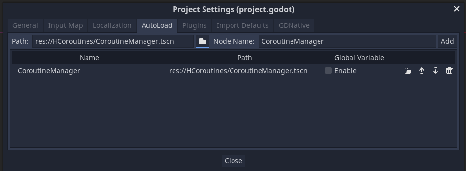

# HCoroutines

   

HCoroutines is a library that helps you write game logic in an **intuitive** way by bringing the concept of **hierarchical coroutines** to Godot (C#). Its built-in coroutine types are specifically designed for Godot, **reducing boilerplate** code and increasing **readability**. At the same time, **async methods** can also be seamlessly integrated with coroutines.

Coroutines are functions that can be paused during execution and then resumed  once some condition is met. This allows you to write game logic in sequential steps, defining what logic should be performed when.

This library extends the idea of normal coroutines by allowing them to spawn child coroutines. When the parent coroutine is killed, the child coroutines are also stopped.

---

HCoroutines implements this concept in an efficient and optimised way.

- Regardless of how deep the hierarchy of coroutines gets, the engine only updates the currently active ones, and not ones that are waiting.

- The coroutines themselves are implemented as linked lists, allowing for `O(1)` addition and removal of child coroutines. Because each coroutine is itself a node in the linked list data structure, no additional memory allocations are required.

---

# Example

```csharp
using Godot;
using System;
using System.Collections;
using System.Threading.Tasks;

// Import the library.
using HCoroutines;

public class Demo : Node2D {
    public override void _Ready() {
        // Spawn a new coroutine that is managed by
        // the default CoroutineManager.
        Co.Run(PlayAnimation());
    }

    private IEnumerator PlayAnimation() {
        GD.Print("Starting animation");

        // Wait one frame.
        yield return null;

        // Wait for the GoTo task to finish before continuing.
        yield return GoTo(new Vector2(100, 100), 2);

        // Wait for two seconds.
        yield return Co.Wait(2);

        // Wait for the parallel coroutine to finish.
        // The parallel coroutine waits until all of its
        // sub-coroutines have finished.
        yield return Co.Parallel(
            Co.Coroutine(GoTo(new Vector2(0, 0), 2)),
            Co.Coroutine(Turn(1))
        );

        // Await an async task that waits for 100ms
        yield return Co.Await(Task.Delay(100));

        // Await and use the result of an async task
        var fetch = Co.Await<int>(FetchNumber());
        yield return fetch;
        int number = fetch.Task.Result;

        // Wait for a tween to animate some properties.
        yield return Co.Tween(
            tween => {
                // Change the modulate color over two seconds.
                tween.TweenProperty(this, "modulate", new Color(1, 0, 0), 2);
            }
        );

        // Waits for a signal to be emitted before continuing.
        yield return Co.WaitForSignal(this, "some_signal");
    }

    private IEnumerator GoTo(Vector2 target, float duration) {
        Vector2 start = Position;
        float speed = Position.DistanceTo(target) / duration;

        while (Position.DistanceTo(target) > 0.01f) {
            // delta time can be accessed via Co.DeltaTime.
            Position = Position.MoveToward(target, duration * Co.DeltaTime);
            yield return null;
        }
    }

    private IEnumerator Turn(float duration) {
        float fullRotation = (float)(2 * Math.PI);
        float angularSpeed = fullRotation / duration;
        float angle = 0;

        while (angle < fullRotation) {
            angle += angularSpeed * Co.DeltaTime;
            Rotation = angle;
            yield return null;
        }
    }

    private async Task<int> FetchNumber() {
        await Task.Delay(100);
        return 0;
    }
}
```

## Setup

1. Go to the Releases page and download the latest version of this library

2. Unzip the files and copy them anywhere into your Godot project

3. In order for the coroutines to be automatically managed and updated each frame, some helper scripts have to be loaded for each scene: Simply go to <kbd>Project</kbd>/<kbd>Project Settings...</kbd> and select the <kbd>AutoLoad</kbd> tab. Then select the path to the `CoroutineManager.tscn` file that was included in the unzipped files and then simply press <kbd>Add</kbd>.



For a complete working example, you can see the demo scene.

## Feature overview

The `Co` class is a static class with useful helper methods to create and run the built-in coroutines. It helps reduce the amount of boilerplate code required to run common coroutines (such as waiting).

Starting a coroutine:

```csharp
Co.Run(coroutine);
```

Stopping a coroutine:

```csharp
coroutine.Kill();
```

 Removing the coroutine from the list of coroutines that are updated each frame:

```csharp
coroutine.PauseUpdates();
```

Adding the coroutine to the update loop again:

```csharp
coroutine.ResumeUpdates();
```

To access the delta time from within a coroutine:

```csharp
float deltaTime = Co.DeltaTime;
```

All coroutines inherit from the `CoroutineBase` class. To define a coroutine in the intuitive / standard way with `IEnumerators`, you can use the `Coroutine` class which wraps the `IEnumerator` (Either via `Co.Coroutine(...)` or `new Coroutine(...)`).

Features of the `Coroutine` class:

- When returning `null`, the coroutine waits for one frame.

- When returning another `IEnumerator`, it is automatically converted into a `Coroutine` and then it waits for it to complete.

- When returning a coroutine (any class that inherits from `CoroutineBase`), it waits until the coroutine is finished before continuing the execution of the `IEnumerator`.

## Coroutine Types

- `CoroutineBase`
  
  - Base class of all coroutines

- `Coroutine` 
  
  - `Co.Coroutine(ienumerator)`
  
  - Default coroutine type for running `IEnumerator`s

- `ParallelCoroutine`
  
  - `Co.Parallel(co1, co2, ...)`
  
  - Runs multiple coroutines in parallel and waits for all to finish

- `SequentialCoroutine`
  
  - `Co.Sequence(co1, co2, ...)`
  
  - Runs the passed coroutines in sequence, one after another

- `RepeatCoroutine`
  
  - `Co.Repeat(n, co)`: Repeats a coroutine `n` times
  - `Co.RepeatInfinitely(co)`: Repeats a coroutine infinitely

- `WaitDelayCoroutine`
  
  - `Co.Wait(delay)`
  
  - Waits for a certain delay in seconds

- `WaitForSignalCoroutine`
  
  - `Co.WaitForSignal(obj, signal)`
  
  - Waits for a signal to be emitted

- `AwaitCoroutine`
  
  - `Co.Await(task)`: Awaits an async tasak
  
  - `Co.Await<T>(task)`: Awaits an asnyc task that returns some value

- `TweenCoroutine`
  
  - `Co.Tween(tween => { ... set up the tween here ... } )`
  
  - Special coroutine that manages a tween instance. Waits until the tween has stopped playing.
